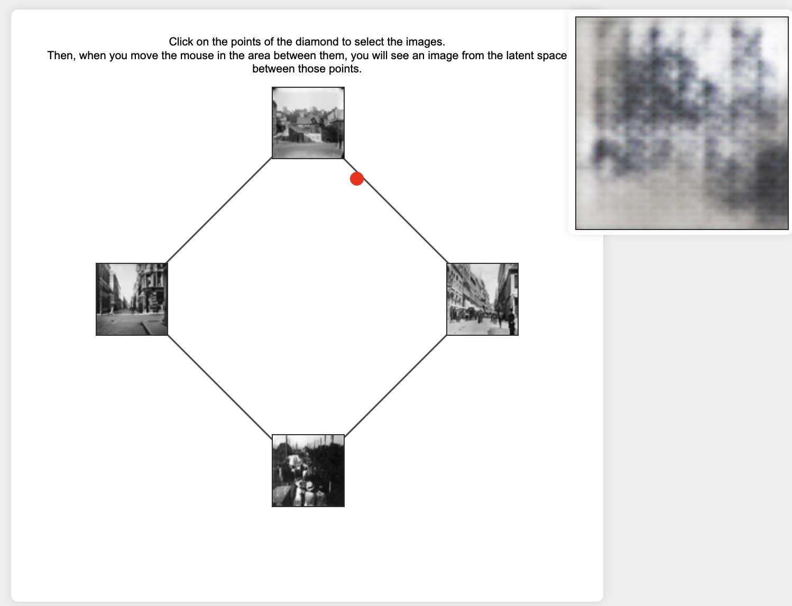

# GAN-latent-space-explorer

There's still value in using GANs to explore materials. This repo is my attempt to recreate the latent space explorer that once allowed people to visualize materials (and the space between!) materials at the MET;


This was the interface for the Met Museum’s ‘Gen Studio’ which no longer exists, though the source code is at https://github.com/microsoft/GenStudio.


This is my version.

1. Use the jupyter notebook to train a GAN
2. clone this repo.
3. use requirements.txt to install everything you need
4. drop the saved generator_model_final.keras file into this same folder on your machine
5. make sure your training images are also in this folder in a 'training_images' subfolder
6. python app.py
7. open browser at http://127.0.0.1:5000/ . Click on the points of the diamond to select the images. Then, when you move the mouse in the area between them, you will see an image from the latent space between those points.

For my intial experiments, I used the oslomini image dataset. These can be retrieved with:

```python
pip install image_datasets
import image_datasets
image_datasets.oslomini.download()
```

though they'll be nested a bit.



_It works! Although the generated images are crap because I didn't run the training for long enough._

for a different dataset, here's 600 pics from palp.art:

```wget https://github.com/shawngraham/pompeii/raw/refs/heads/main/downloaded_images.zip```

check app.py to make sure using this folder. The model file in this repo was trained for 1000 iterations. The model training code, such as it is, is on [colab](https://colab.research.google.com/drive/1zjaAUJ2YIvM655XBGe0Dc9Uh8TH64V-G?usp=sharing). It'd probably be better to use something dcgan but hey, all this is an experiment.

memo to self - conda activate lscope_tf217
